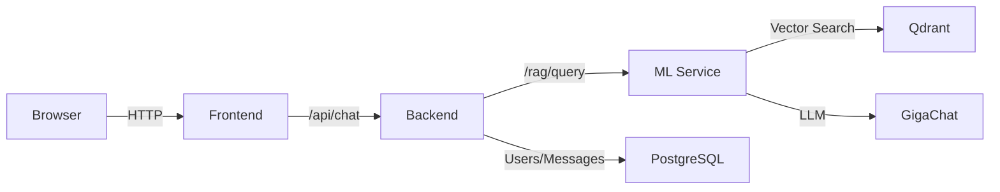

# TJ Assistant - AI-ассистент по статьям Тинькофф Журнала

Интеллектуальный чат-бот с RAG (Retrieval-Augmented Generation) для поиска информации в базе статей Тинькофф Журнала.

## 🏗️ Архитектура

Проект состоит из нескольких микросервисов:

- **Frontend** (React + Vite) - веб-интерфейс на порту 3000
- **Backend** (FastAPI) - API для чата, аутентификации, работы с БД на порту 8000
- **ML Service** (FastAPI + LangChain) - RAG система с GigaChat на порту 8001
- **Qdrant** - векторная база данных для семантического поиска на порту 6333
- **PostgreSQL** - реляционная БД для пользователей и чатов на порту 5432



## 📋 Требования

- Docker и Docker Compose
- Python 3.11+ (для локальной разработки)
- Node.js 25+ (для локальной разработки frontend)

## 🔑 Получение API ключей

### 1. GigaChat API Key

**Обязательно** для работы ML сервиса.

1. Зарегистрируйтесь на [developers.sber.ru](https://developers.sber.ru/)
2. Перейдите в раздел [GigaChat API](https://developers.sber.ru/portal/products/gigachat-api)
3. Получите AUTH_KEY
5. Полученный токен используйте как `GIGACHAT_AUTH_KEY`

**Пример:**
```
GIGACHAT_AUTH_KEY=NTZjMTkxYzctMWQ3Mi00ZmU5LWI1YzMtODc5MWFmNzAwMmY2OmRlZmF1bHQ=
```

## ⚙️ Настройка переменных окружения

### Backend (.env или docker-compose.yaml)

Создайте файл `backend/.env` (или добавьте в `environment` в docker-compose.yaml):

```env
SECRET_KEY=ваш-secret-key
```

### ML Service (.env)

Создайте файл `tj-ml/.env`:

```env
GIGACHAT_AUTH_KEY=ваш-gigachat-token
QDRANT_URL=http://qdrant:6333
QDRANT_COLLECTION=tj
EMBEDDING_MODEL_NAME=intfloat/multilingual-e5-large
HF_TOKEN=ваш hf-токен
token=ваш hf_token (я просто хз, какой секрет он юзает)
```

## 🚀 Быстрый старт

### 1. Клонируйте репозиторий

```bash
git clone <repository-url>
cd tj-assistant
```

### 2. Настройте переменные окружения

```bash
# Создайте .env файл для ML сервиса
cat > tj-ml/.env << EOF
GIGACHAT_AUTH_KEY=ваш-gigachat-token
EOF

chmod 644 tj-ml/.env

# Добавьте SECRET_KEY в docker-compose.yaml или создайте backend/.env
```

### 3. Запустите все сервисы

```bash
docker compose up -d --build
```

Это запустит:
- PostgreSQL
- Qdrant
- Индексатор (одноразовая индексация статей ~15-20 минут)
- ML Service
- Backend
- Frontend

### 4. Дождитесь завершения индексации

Проверить прогресс индексации:

```bash
# Логи индексатора
docker compose logs indexer -f

# Количество проиндексированных документов
curl -s http://localhost:6333/collections/tj | grep points_count
```

Когда увидите "Успех! Данные загружены в коллекцию 'tj'." - индексация завершена.

### 5. Накатить миграции в БД

Запустить контейнеры Backend и Postgres
В терминале, находясь в папке с проектом написать: 
1) docker compose exec backend bash (откроет терминал внутри контейнера)
2) alembic init migrations
В папке проекта появится папка migrations, в ней в файле env.py:
1) Добавить строку from app.models.models import Base
2) Заменить строку target_metadata = None на target_metadata = Base.metadata
Далее снова в терминале (внутри контейнера):
1) alembic revision --autogenerate -m "Init"
2) alembic upgrade head

Если возникнет проблема с применением миграций следует:
1) В терминале: docker compose exec backend bash (если ещё не внутри контейнера)
2) Далее ввести команду (она очистит информацию о миграциях):
python -c "
import asyncio
from sqlalchemy import text
from app.database.session_async import engine

async def reset():
    async with engine.connect() as conn:
        await conn.execute(text('DROP TABLE IF EXISTS alembic_version'))
        await conn.commit()

asyncio.run(reset())
"
Или если не помогло:
Удалить в Docker volume с названием tj_assistant_postgres_data

### 7. Откройте приложение

Перейдите в браузере: **http://localhost:3000**

Авторизуйтесь с тестовыми данными:
- Email: `test@example.com`
- Password: `testpassword123`

## 📊 Управление сервисами

```bash
# Просмотр логов
docker compose logs -f <service>          # ml, backend, frontend, qdrant, postgres

# Перезапуск сервиса
docker compose restart <service>

# Остановка всех сервисов
docker compose down

# Полная очистка (включая volumes)
docker compose down -v

# Переиндексация с очисткой
curl -X DELETE "http://localhost:6333/collections/tj"
docker compose up -d indexer
```

## 🔧 Конфигурация

### Модель эмбеддингов

По умолчанию используется `intfloat/multilingual-e5-large` (лучшая для русского языка).

Для изменения модели:
1. Обновите `EMBEDDING_MODEL_NAME` в `tj-ml/.env`
2. Переиндексируйте данные

Доступные модели:
- `intfloat/multilingual-e5-large` (рекомендуется, 1024 dim)
- `intfloat/multilingual-e5-base` (быстрее, 768 dim)
- `sentence-transformers/all-MiniLM-L6-v2` (быстрая, 384 dim)

### Модель GigaChat

По умолчанию используется базовая модель `GigaChat`.

Для использования улучшенных моделей отредактируйте `tj-ml/src/app/services/llm.py`:

```python
return GigaChat(
    credentials=settings.gigachat_auth_key,
    model="GigaChat-Pro",  # или "GigaChat-Plus"
    verify_ssl_certs=False,
)
```

## 📈 Итеративное улучшение качества RAG

ML сервис поддерживает оценку качества через эндпоинты:

```bash
# Запустить оценку
curl -X POST "http://localhost:8001/eval/run" \
  -H "Content-Type: application/json" \
  -d '{"run_name": "test_run"}'

# Проверить статус
curl "http://localhost:8001/eval/status?run_id=<run_id>"

# Получить отчёт
curl "http://localhost:8001/eval/report?run_id=<run_id>"
```

Для улучшения качества:
1. Изменяйте параметр `top_k` (количество документов для контекста)
2. Меняйте модель эмбеддингов
3. Улучшайте промпт в `tj-ml/src/app/services/rag_chain.py`
4. Расширяйте golden dataset в `tj-ml/src/app/data/eval_golden.json`

## 🐛 Устранение неполадок

### Ошибка "SECRET_KEY not specified"
- Убедитесь, что `SECRET_KEY` добавлен в `backend/.env` или `docker-compose.yaml`
- Перезапустите backend: `docker compose restart backend`

### Ошибка "Invalid token"
- Создайте и активируйте тестового пользователя (см. шаг 6)
- Проверьте, что токен корректно передаётся в заголовке Authorization

### ML сервис не отвечает
- Проверьте, что индексация завершена: `docker compose logs indexer`
- Проверьте логи: `docker compose logs ml`
- Убедитесь, что `GIGACHAT_AUTH_KEY` корректен

### PostgreSQL не запускается
- Если видите ошибку о версии 18+, используется `postgres:16` в docker-compose.yaml
- Очистите volumes: `docker compose down -v && docker compose up -d`

## 📝 Структура проекта

```
.
├── backend/              # FastAPI backend
│   ├── app/
│   │   ├── api/         # Эндпоинты
│   │   ├── core/        # Конфигурация, безопасность
│   │   ├── database/    # Подключение к БД
│   │   ├── models/      # SQLAlchemy модели
│   │   └── services/    # Бизнес-логика
│   ├── migrations/      # Alembic миграции
│   └── requirements.txt
├── frontend/
│   └── TJ-Assistant/    # React + Vite приложение
├── tj-ml/               # ML RAG сервис
│   ├── src/
│   │   ├── app/
│   │   │   ├── services/   # RAG, эмбеддинги, LLM
│   │   │   ├── schemas/    # Pydantic модели
│   │   │   └── main.py     # FastAPI приложение
│   │   ├── data/           # Статьи и golden dataset
│   │   └── index.py        # Скрипт индексации
│   └── requirements.txt
└── docker-compose.yaml
```

## 🤝 Разработка

### Локальная разработка Backend

```bash
cd backend
python -m venv venv
source venv/bin/activate
pip install -r requirements.txt
uvicorn app.main:app --reload --port 8000
```

### Локальная разработка ML Service

```bash
cd tj-ml/src
python -m venv venv
source venv/bin/activate
pip install -r ../requirements.txt
uvicorn app.main:app --reload --port 8001
```

### Локальная разработка Frontend

```bash
cd frontend/TJ-Assistant
npm install
npm run dev
```
